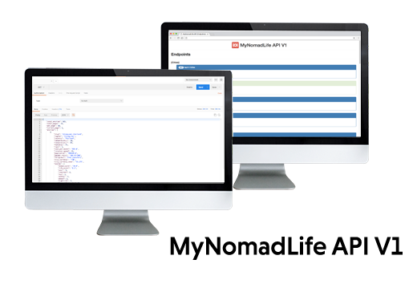

# MyNomadLife API V1 1.0.0



This Ruby on Rails application provides an implementation of back-end API solution for Android application MyNomadLife. The project uses PostgreSQL database as database backend and ActiveModelSerializer for serialization database data to JSON format.

[Screenshots](Screenshots/)

## Installation

* Install all necessary ruby gems `bundle install`
* Setup a database connection `vim config/database.yml`

## Setup

* Create a database `bundle exec rake db:create`
* Migrate database tables `bundle exec rake db:migrate`
* Copy data to `./db/csvs/` and `./db/images/`
* Populate a database `bundle exec rake db:seed`

## Requirements

* Ruby on Rails 5
* SQLite3 / PostgreSQL

## Run application

* `rails s`

## Libraries

 * [Twitter Bootstrap](https://github.com/twbs/bootstrap-sass) - Twitter Bootstrap for Sass
 * [Font Awesome](http://fontawesome.io/) - The iconic font and css toolkit
 * [ActiveModel::Serializer](https://github.com/rails-api/active_model_serializers) - ActiveModel::Serializer is set of Rails hooks for data serialization
 * [Carrierwave](https://github.com/carrierwaveuploader/carrierwave) - Classier solution for file uploads for Rails, Sinatra and other Ruby web frameworks
 * [mini-magick](https://github.com/minimagick/minimagick) - A ruby wrapper for ImageMagick or GraphicsMagick
 * [Rest client](https://github.com/rest-client/rest-client) - A simple HTTP and REST client for Ruby language
 * [RSpec](http://rspec.info/) - Behaviour Driven Development for Ruby
 
# License - Apache License, Version 2.0

```
# (C) Copyright 2017 by Marek Hakala <hakala.marek@gmail.com>
# Licensed under the Apache License, Version 2.0 (the "License");
# you may not use this file except in compliance with the License.
# You may obtain a copy of the License at
#
# http://www.apache.org/licenses/LICENSE-2.0
#
# Unless required by applicable law or agreed to in writing, software
# distributed under the License is distributed on an "AS IS" BASIS,
# WITHOUT WARRANTIES OR CONDITIONS OF ANY KIND, either express or implied.
# See the License for the specific language governing permissions and
#    limitations under the License.
```
